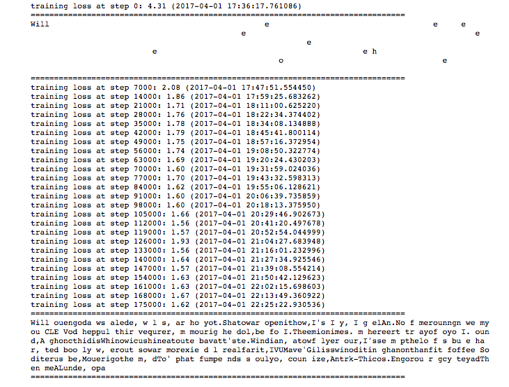

# Shakespeare-generator
Using Tensorflow, I created a generator that creates new Shakespearean work. Data-set was all of Shakespeare's plays.
**Go to /Notebook/chatbot-master.ipynb -> Scroll to bottom to see output.**
Looks like:

# (March 27) It works! With salty hardware limitations...
It's ok though, hardware limitations proove that you're doing your best
Have a look at the notebook and scroll all the way to the bottom to see results.
I only could get her at 50,000 iterations to a loss of 1.7; It only trained for about 2 hours on my 2 GPU's. 
I went from a test train which took 12 hours and 100% of my CPU (loss only hit 2.2); then I made modifications and using 97% of RAM and only 40% CPU I managed to cut the time to 2 hours and a loss of 1.7

# Update: (April 9) using floyd
I used the Floyd machine learning website and managed to get a better outcome, although not understandable a plan to make a better version soon.

# For the model data:
got to
    /Notebook/ckpt/*
These are all of the **most recent** checkpoint stats.
